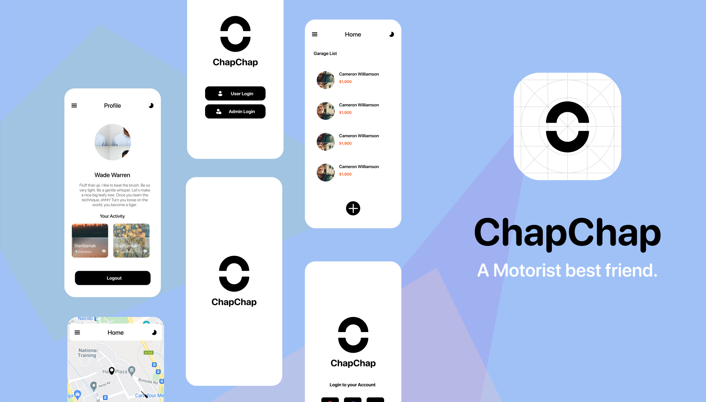
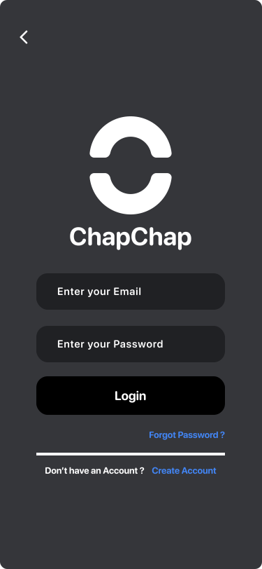
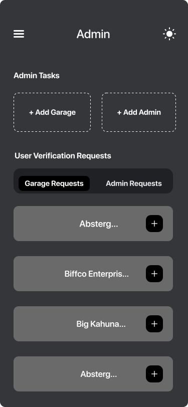
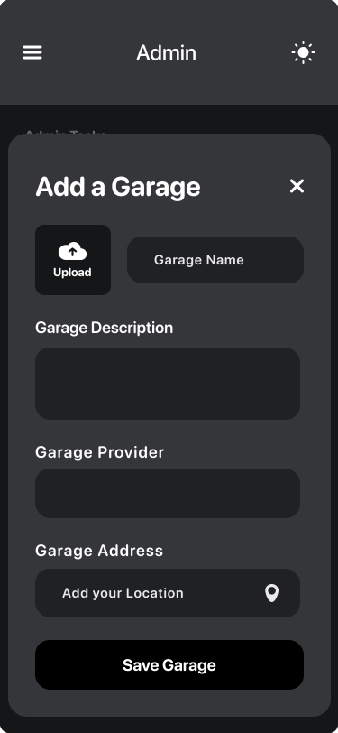

<p align="center">
    
</p>
<h4 align="center">A Motorist best friend.</h4>
<p align="center">
    
     <a href="https://github.com/rocksdanister/lively/wiki"></a>
     
     <a href="https://github.com/rocksdanister/lively/stargazers"></a>
</p>

<p align="center">
  <a href="#About">About</a> •
  <a href="#initialization">Project Setup</a> •
  <a href="#features">Features</a> •
  <a href="#contributing">Contributing</a> •
  <a href="#license">License</a>
</p>

<p align="center"></p>

<h1 id="About">About ChapChap  🧰</h1>

`Chapchap` helps motorist find the nearest garage when their vehicle has broken down. Its a project built as one of my institution showcase projects.

<p id="initialization"></p>

## Project Setup 🧪

### Project Initialization

This Project is built using  Flutter, you can setup flutter using [this docs](https://docs.flutter.dev/get-started/install).

To setup the project, have to clone this repository to your local drive.

```python
git clone <REPO>
```

Then you have to initialize flutter in the project by running the following command and congrats 🎉 you have the project setup.

```shell
flutter pub get
```

### Running & Testing 🧪

To run the application and test it in the android environment. Launch your terminal and run the following commands.

```shell
flutter run
```

To run it on the `Web : Chrome` platform, launch your terminal and run.

```shell
flutter run -d chrome
```

## Features

The application contains the following features.

- [ ] `Auth :` user Authentication
- [ ] `Profile:` User Profiles & settings
- [ ] `Admin Home:` User Administrator dash and home
- [ ] `User Home:` Client User home and way finder

### Auth 🔐

This page deals with user authentication and user verification. The features in this include ;

1. User Authentication using email & password
2. Google and facebook user authentication
3. User registration and verification

Below are screenshot pages

| Auth Page                                                                   | Login Page                                                                   |
| --------------------------------------------------------------------------- | ---------------------------------------------------------------------------- |
|  |  |

### User Home

First Page the user sees, its where the user can look for nearby service centers. One can manually search for a garage or use the map select the garage of choice.

1. Map view for showing the nearby service centers
2. Search overlay for finding nearby service centers

Below are the shots

| User Home Page                                                                   | User Home Overlay Page                                                                   |
| -------------------------------------------------------------------------------- | ---------------------------------------------------------------------------------------- |
|  |  |

### Admin Home

The first page an admin meets when one logins into the app. It helps one administer the app and control it.

The features that can be controlled in this app are;

1. Add or remove a service center from the app
2. Enable or disable automatic google service centers

| Admin Home Page                                                                   | Admin Home Overlay Page                                                                   |
| --------------------------------------------------------------------------------- | ----------------------------------------------------------------------------------------- |
|  |  |

### Profile

This screen shows the profile of the user. Its also provides options for users such as admin

| Profile                                                                           |
| --------------------------------------------------------------------------------- |
|  |
